# Minimal Linux Scripts

Big thank you to [ivandavidov's](https://github.com/ivandavidov) [Minimal Linux Live](http://github.com/ivandavidov/minimal) work, it laid the foundation for this. I was extremely impressed with their [minimal-linux-script](https://github.com/ivandavidov/minimal-linux-script) repo, which built me a bootable image in minutes.

Inspired by this, a human-readable bare-minimum linux creation tool, I went wild. I had just found about [fzf](https://github.com/junegunn/fzf), a bash based fuzzy finder, and thought I could really make this thing fully featured without adding too many dependencies. This resulted in my version of minimal.sh, which can no longer be said to be human-readable, or at least maintainer friendly. It uses fzf, curl, grep, sed, uniq, tac, tar, patch, gunzip, and wget to create menus to select the versions of linux, realtime patches, busybox, and syslinux. I would recommend leaving syslinux's version defined in the file, as it then grabs the latest, which is the only one thats worked for me in all cases. 

In theory, you should only have to `./minimal.sh` and follow the prompts. I prioritized realtime kernel patches, as this is usually some hidden, obfuscated kernel feature. Most of my embedded images are for audio applications on armv7l cores, so I did this for me. I have also added a dvorak.kmap file, and a function to install this onto the minimal.sh system. This is also a poorly documented process if you are a beginner trying to figure out console keymaps. 

After this minimal.sh script was complete, I decided to expand slightly and create a minimal buildroot image. This is more fully-featured, as it has networking support, a ton of packages, and a ton of configuration options. It still compiles a rather small iso. I have also added a little "What I wish I knew when I started doing all this" message at the end of compilation. To make things simpler, maybe, for an end user, you can also use the static-get utility to plop ready-made binaries into the target system, without spending ages running make. It seemed to work for gcc and bash, and it works on my other systems.

One script which generates fully functional live Linux ISO image with minimal effort. This is based on the first published version of [Minimal Linux Live](http://github.com/ivandavidov/minimal) with some improvements taken from the next releases. All empty lines and comments have been removed and the script has been modified to reduce the overall length.

While I'm rather fond of buildroot, I think the fzf finder to choose a linux kernel is geniunely useful outside of this project. I hope more people find out about fzf and make their lives easier.

# Using minimal.sh

You can run `./minimal.sh` and follow the prompts. It uses a fuzzy finder, so you can either type and it will select the best match, use the arrow keys, page up/down, or double click with a mouse to select your entry. The default options are the latest versions. 

When you're done, run `./qemu64.sh` to actually run the thing! If you want it to be very fast: `./qemu64.sh fast`, to use the kvm features.

Please note that any kernel after 4.19 requires GCC to be at least 4.6.0. 

# Using buildroot.sh

run `./buildroot.sh` and wait about 30 minutes. This'll generate a basic iso, just like minimal, but with some added options. Notably, the entire buildroot infrastructure of packages, tons more options, external toolchains, whatever. If you don't want to build a billion dependencies, you can also add any binary to the EXTRA_PACKAGES variable in the buildroot.sh script. This'll use static-get to throw stuff into the overlay. This is a workaround for possibly shipping a buildroot system with gcc on it, for example.

At the end, it runs:
`cp images/rootfs.iso9660 br-rootfs.iso; 
qemu-system-x86_64 -m 512M -cdrom br-rootfs.iso -boot d -vga std -smp 4 -device e1000`

# minimal.sh example

